# Hi, I'm Mithun 👋

I'm a fourth-year Computer Science student at Toronto Metropolitan University with a passion for full-stack development, data engineering, and machine learning. I love building things that are clean, scalable, and actually useful.

- 🎓 Honours Bachelor of Computer Science (Co-op) @ TMU
- 💼 Co-op experience at Environment and Climate Change Canada and Ontario Ministry of Treasury Board Secretariat
- 🏀 Big NBA fan, built out a prediction platform and currently building a tool to help fantasy basketball players win their leagues
- 🌱 Currently exploring ML applications and expanding my knowledge on full-stack architecture

---

## 🛠 Tech Stack

**Languages**

**Frontend**

**Backend & Data**

**ML & Tools**

---

## 🚀 Featured Project

### [NBA Predictive Analytics Platform](https://github.com/mithun-s14)
An end-to-end ML platform that predicts NBA player statistics using an ensemble of 6 models (Linear, Bayesian, Random Forest, XGBoost, Gradient Boosting, LightGBM) trained on 500+ active players. Features an automated daily data pipeline via GitHub Actions, a Gradio interface with real-time predictions under 2s, and is deployed on Hugging Face Spaces with CI/CD and zero downtime.

---

## 📊 GitHub Stats

---

## 📬 Connect With Me

