# Hi, I'm Mithun 👋🏾

I'm a Computer Science graduate from Toronto Metropolitan University with interests in full-stack development, data engineering, and machine learning. I enjoy building software that is clean, scalable, and performant.

- 🎓 Honours Bachelor of Computer Science (Co-op) @ TMU
- 💼 Internship experience at Environment and Climate Change Canada and Ontario Ministry of Treasury Board Secretariat
- 🏀 Built out a prediction platform and fantasy basketball tool to help players win their leagues
- 🌱 Building and learning across the AI stack

---

## 🚀 Featured Projects

### [NBA Predictive Analytics Platform](https://huggingface.co/spaces/mithun14/prop-model)
An end-to-end ML platform that predicts NBA player statistics using an ensemble of 6 models (Linear, Bayesian, Random Forest, XGBoost, Gradient Boosting, LightGBM) trained on 500+ active players. Features an automated daily data pipeline via GitHub Actions, a Gradio interface with real-time predictions under 2s, and is deployed on Hugging Face Spaces with CI/CD and zero downtime.

### [Fantasy Basketball Companion](https://fantasy-basketball-companion.vercel.app/)
Full-stack web application for fantasy basketball enthusiasts featuring a schedule analyzer, AI-powered (Gemini) coach, roster management, and matchup analysis in a unified platform.

### [SimpleBL](https://mithun-s14.github.io/SimpleBL/)
Evidence-based fitness research assistant that surfaces peer-reviewed literature fromo PubMed over regular google searches to help lifters make informed decisions

---

## 📊 GitHub Stats
<!-- 

 -->

---

## 📬 Connect With Me

